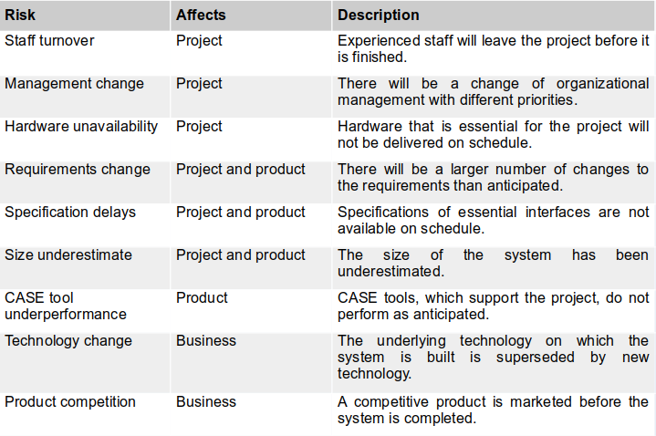
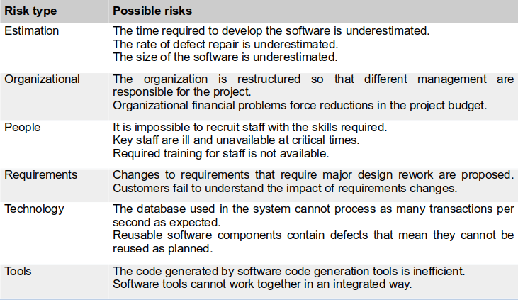
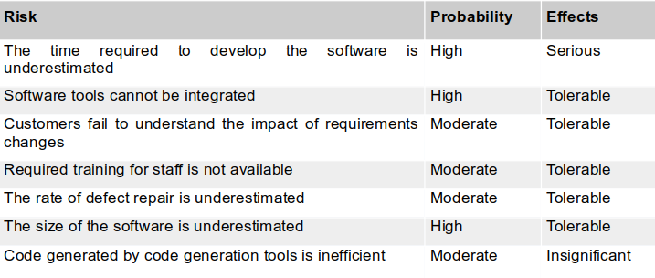
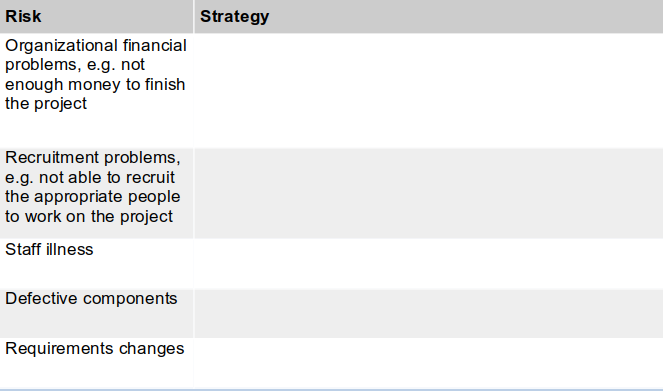
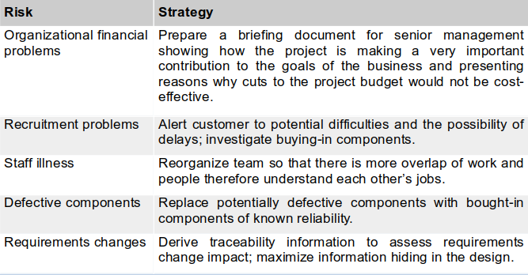
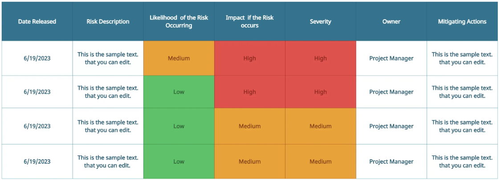

# Risk Management

    Course Code: ELEE1149 
    
    Course Name: Software Engineering

    Credits: 15

    Module Leader: Seb Blair BEng(H) PGCAP MIET MIHEEM FHEA

---

## Software project management

- Concerned with activities involved in ensuring  that software is delivered on time and on schedule and in accordance with the requirements of the organisations developing and buying the software.

- Project management is needed because software development is always subject to budget and schedule constraints that are set by the organisation developing the software

---

## Success Criteria

- Deliver the software to the customer at the agreed time.

- Keep overall costs within budget.

- Deliver software that meets the customer’s expectations.

- Maintain a coherent and well-functioning development team.

---

## Software engineering is different from other types of engineering 

- The product is immaterial
  - Software cannot be seen or touched. Software project managers cannot see progress by simply looking at the artefact that is being constructed. 

- Many software projects are 'one-off' projects
  - Large software projects are usually different in some ways from previous projects as every environment where software is developed is, in some ways, different from all others. Even managers who have lots of previous experience may find it difficult to anticipate problems. 

- Software processes are variable and organization specific
  - We still cannot reliably predict when a particular software process is likely to lead to development problems. 

---

## Factors influencing project management

These factors mean that project managers in different organizations may work in quite different ways. 

- Company size – small or large companies
- Software customers – internal, external, governmental agency
- Software size – small systems – small teams, large systems – can be geographically distributed
- Software type – consumer or safety critical 
- Organizational culture – encouraging individual or group focused approach
- Software development processes – agile – lightweight management, others – more formal 

---

## Universal management activities

- Project planning 
  - Project managers are responsible for planning, estimating and scheduling project development and assigning people to tasks.

- Risk management
  - Project managers assess the risks that may affect a project, monitor these risks and take action when problems arise.  

- People management 
  - Project managers have to choose people for their team and establish ways of working that leads to effective team performance.

---
## Universal management activities

- Reporting 
  - Project managers are usually responsible for reporting on the progress of a project to customers and to the managers of the company developing the software. 

- Proposal writing 
  - The first stage in a software project may involve writing a proposal to win a contract to carry out an item of work. The proposal describes the objectives of the project and how it will be carried out. 

---

## Risk Management

All previous content has associated risk attached to them... 

So what does risk management involve?

---

## Risk Management

- One of the most important jobs of a project manager

- Risk management is concerned with identifying risks and drawing up plans to minimise their effect on a project.

- Software risk management is important because of the inherent uncertainties in software development. 
  -  These uncertainties stem from loosely defined requirements, requirements changes due to changes in customer needs, difficulties in estimating the time and resources required for software development, and differences in individual skills. 

- You have to anticipate risks, understand the impact of these risks on the project, the product and the business and take steps to avoid these risks. 

---

## Risk classification

There are two dimensions of risk classification

--- 

## What is affected by the risk

  - **Project risks** 
    - affect schedule or resources;
  - **Product risks**  
    - affect the quality or performance of the software being developed;
  - **Business risks** 
    - affect the organisation developing or buying the software.

---

## Examples of project, product, and business risks 

---

## Segway : CASE Tooling

**Computer Aided Software Engineering**

- Diagramming Tools
- Computer Display and Report Generators
- Analysis Tools
- Central Repository
- Documentation Generators
- Code Generators
---

## The risk management process

- *Risk identification*
  - Identify project, product and business risks;

- *Risk analysis*
  - Assess the likelihood and consequences of these risks;

- *Risk planning*
  - Draw up plans to avoid or minimise the effects of the risk;

- *Risk monitoring*
  - monitor the risks throughout the project;

---

## The risk management process 

---

## Risk identification

- May be a team activity or based on the individual project manager’s experience

- A checklist of common risks may be used to identify risks in a project
  - Estimation risks.
  - Organizational risks.
  - People risks.
  - Requirements risks.
  - Technology risks.
  - Tools risks.

---

## Examples of different risk types

---

## Risk analysis

- Assess probability and seriousness of each risk.

- Probability may be very low, low, moderate, high or very high.

- Risk consequences might be catastrophic, serious, tolerable or insignificant.

---

## Risk types and examples

---

## Risk types and examples 

---

## Risk Planning

- Consider each risk and develop a strategy to manage that risk. The project manager has to think of actions that need to be taken to minimize the disruption to the project if a specified risk occurs

- *Avoidance strategies*
  - The probability that the risk will arise is reduced, example – strategy with dealing with defective components in the table that follows

- *Minimization strategies*
  - The impact of the risk on the project or product will be reduced, example – the strategy for staff illness in the table that follows

- *Contingency plans*
  - If the risk arises, contingency plans are plans to deal with that risk, example – the strategy for organisational financial problems in the table that follows

---

## Strategies to help manage risk 

---

## Strategies to help manage risk 

---

## Risk Monitoring

- Assess each of the identified risks regularly to decide whether or not it is becoming less or more probable.

- Also assess whether the effects of the risk have changed.

- Each key risk should be discussed at management progress meetings.

---

## Risk Indicators

---

## Using RAG/BRAG in Risk Management

- **RAG (Red, Amber, Green):**
  - Red: Critical risks requiring immediate attention.
  - Amber: Risks needing monitoring and potential mitigation.
  - Green: Risks under control or with acceptable impact.

- **BRAG (Blue, Red, Amber, Green):**
  - Blue: Potential opportunities (optional).
  - Red: Critical risks.
  - Amber: Risks requiring attention.
  - Green: Risks under control or resolved.
---

## BRAG Risk Management Status

  

    <h2>Blue</h2>
    
Potential Opportunities

  

  

    <h2>Red</h2>
    
Critical Risks

  

  

    <h2>Amber</h2>
    
Risks Requiring Attention

  

  

    <h2>Green</h2>
    
Risks Under Control or Resolved

  

---

## RAG Risk Management Matrix
 <table>
    <thead>
      <tr>
        <th></th>
        <th class="red">Red</th>
        <th class="amber">Amber</th>
        <th class="green">Green</th>
      </tr>
    </thead>
    <tbody>
      <tr>
        <td><strong>Category 1</strong></td>
        <td class="red">Critical Risks</td>
        <td class="amber">Risks Needing Attention</td>
        <td class="green">Risks Under Control or Resolved</td>
      </tr>
      <tr>
        <td><strong>Category 2</strong></td>
        <td class="red">More Critical Risks</td>
        <td class="amber">Risks Requiring Monitoring</td>
        <td class="green">Risks Under Control or with Acceptable Impact</td>
      </tr>
      <tr>
        <td><strong>Category 3</strong></td>
        <td class="red">Yet Another Critical Risk</td>
        <td class="amber">Risks to Address Soon</td>
        <td class="green">Risks Under Control or Resolved</td>
      </tr>
    </tbody>
  </table>

---

## Implementing RAG/BRAG in Software Projects

- **Assigning Colors:**
  - Criteria for assigning Red, Amber, Green (or Blue) to risks.
  - Consistent application across the project.

- **Regular Updates:**
  - Periodic reviews and updates of risk status.
  - Real-time adjustments based on project dynamics.

---

## Benefits of RAG/BRAG in Software Risk Management

- **Clear Communication:**
  - Simple visual indicators enhance communication.
  - Stakeholders quickly grasp the project's risk status.

- **Proactive Decision-Making:**
  - Enables proactive decision-making.
  - Focuses attention on critical risks for timely resolution.

- **Continuous Improvement:**
  - Facilitates continuous improvement.
  - Lessons learned from past projects inform future risk management strategies.

---

## RAG for Risk Matrix

---

## RAG for RisK Matrix

