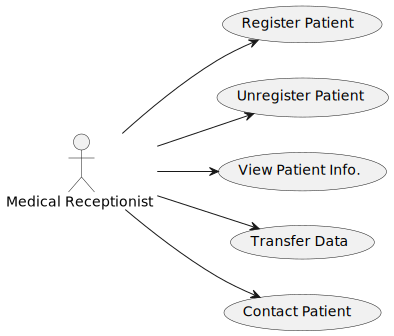

# System Modelling Part 1

    Course Code: ELEE1149 
    
    Course Name: Software Engineering

    Credits: 15

    Module Leader: Seb Blair BEng(H) PGCAP MIET MIHEEM FHEA

---

## Topics Covered

- Context models

- Interaction models

- Structural models

---

## System modelling

- System modelling is the process of developing abstract models of a system, with each model presenting a different view or perspective of that system. 

- System modelling is representing a system using graphical notation, which is now almost always based on notations in the Unified Modelling Language (UML). 

- System modelling helps the analyst to understand the functionality of the system and models are used to communicate with customers.

---

## System perspectives

- Different models can be developed to represent the system from different perspectives:
  - An external perspective, where you model the context or environment of the system.
  
  - An *interaction perspective*, where you model the interactions between a system and its environment, or between the components of a system.
  
  - A *structural perspective*, where you model the organisation of a system or the structure of the data that is processed by the system.
  
  - A *behavioural perspective*, where you model the dynamic behaviour of the system and how it responds to events. 

---

## UML diagram types

- **Activity diagrams**, which show the activities involved in a process or in data processing .

- **Use case diagrams**, which show the interactions between a system and its environment. 

- **Sequence diagrams**, which show interactions between actors and the system and between system components.

- **Class diagrams**, which show the object classes in the system and the associations between these classes.

- **State diagrams**, which show how the system reacts to internal and external events. 

Question: Why use graphical models?

---

## Use of graphical models

- As a means of facilitating discussion about an existing or proposed system
  - Incomplete and incorrect models are OK as their role is to support discussion.

- As a way of documenting an existing system
  - Models should be an accurate representation of the system but need not be complete.

- As a detailed system description that can be used to generate a system implementation
  - Models must be both correct and complete.

---

## Mentcare system & sub-systems

---

## Process perspective

- Context models simply show the other systems in the environment, not how the system being developed is used in that environment.

- Business Process models reveal how the system being developed is used in broader business processes.

- UML activity diagrams may be used to define business process models. They show the activities in a process and the flow of control from one activity to another

---

## Process model of involuntary detention using UML activity diagram

<!--
https://mermaid.live/edit#pako:eNqFlN1u4jAQhV_F8uWKvkBUIaEgBKKgKA5XBFXe2AFvExs5ptqq6rvvjJ0faCjLVezzZXwyc_AnLYyQNKKN407OFT9aXueawE8oKwunjCYvadjxDFHla3h4fi5ORhVyOg1yPJ9HJDa6VLbOYUtIJzUWCItCNfjs0VVi0oisdGkCmnCngCWmxFWqjifXBDLFoqksjBUoza9rzm9qsk0cgSfCPhonawKucr0BuACvgViwJCILpQVpZHGxEmucK1608ixbRmQmauWIM6gtTXNWjldt_Rkb1Ue6QQsNLIIQ4CxLgM4s100pbVsvMRW0izDoXu86y9hyBAZ7385fsfi6ZcwUipOY29b9arvuZKLlX4eMKclatQftoOG7s8BmYIvlUYFbS3Kdt8D-14E8PU1xjGGjGziUfOtHjotu4H7k_p0B6ZSrlxDAgf8gpcN5MMJh69bEH6N0bwIXgwms7V8bmE5KW39j5aoeAl2oO7kPOYoLXjUyInvB9VFac2kO5C6X2Qti2jgyoB2JYqjGkm7PF_abkL3hiyFpw2ZLsiQc4XPlj-DvXFX8dyUPYwgztR8D35sKOTNavD4YMFjwJcdk_13g6D4yEGz5M9E7Gp3gc8Pi_wDb9WNgl96NkjspG9hxnlg8hGbgenm7fiTv0kdql_BdehPEKzeowl-RTmgtbc2VgMv50zeKupOsZU4jeBQcatJcfwHHL86wD13QyEHGJvTi_-XtXU6jEkM2oVIoZ-wm3Pb-0v_6B5zY344
-->

---

## Interaction models

- Modelling user interaction is important as it helps to identify user requirements. 

- Modelling *component interaction* helps us understand if a proposed system structure is likely to deliver the required system performance and dependability. 

- *Use case diagrams* – used to model the interactions between a system and external agents - human users or other systems

- *Sequence diagrams* – used to model interactions between system components

---

## Use case modeling

- A *use case* is a simple description of what a user expects from a system in the interaction

- Each use case represents a discrete task that involves external interaction with a system.

- As use cases give a simple overview of an interaction (represented by a verb), more detail needs to be added in the form of textual description, a structured description in a table, or a sequence diagram

- *Actors* in a use case may be people or other systems.
A use case is shown as an ellipse and the actors involved – as stick figures

---

## Transfer-data use case diagram 

- A use case in the Mentcare system

---

## Tabular description of the  Transfer-data use case 

<table>
    <thead>
        <tr>
            <th colspan=2>MHC-PMS: Transfer data</th>
        </tr>
    </thead>
    <tbody>
        <tr>
            <td>
             Actors
            </td>
            <td>
            Medical receptionist, patient records system (PRS)
            </td>
        </tr>
        <tr>
            <td>
             Description
            </td>
            <td>
            A receptionist may transfer data from the Mentcase system to a general patient record database that is maintained by a health authority. The information transferred may either be updated personal information (address, phone number, etc.) or a summary of the patient’s diagnosis and treatment.Medical receptionist, patient records system (PRS)
            </td>
        </tr>
        <tr>
            <td>
             Data
            </td>
            <td>
            Patient’s personal information, treatment summary
            </td>
        </tr>
        <tr>
          <td>
             Stimulus
          </td>
           <td>
            User command issued by medical receptionist
          </td>
        </tr>
        <tr>
          <td>
             Response
          </td>
           <td>
            Confirmation that PRS has been updated
          </td>
        </tr>
        <tr>
          <td>
             Comments
          </td>
           <td>
            The receptionist must have appropriate security permissions to access the patient information and the PRS.
          </td>
        </tr>
    </tbody>
</table>

---

## Use cases in the Mentcare system involving the role ‘Medical Receptionist’ 

<!--
https://www.plantuml.com/plantuml/uml/SoWkIImgAStDuUAoSiiiAYvHS4mkoI-ouh9opCiloKWjYibB10ie91Oh-2Rc6N61kGhX-Rc9USPGZfLF8b0ZGbr0Qb5nVfuX5vT3QbuAo6m0
-->

---

## Sequence diagrams

- *Sequence diagrams* are part of the UML and are used to model the interactions between the actors and the objects within a system.

- A sequence diagram shows the sequence of interactions that take place during a particular use case or use case instance.

---

## Sequence diagrams

- The objects and actors involved are listed along the top of the diagram, with a dotted line drawn vertically from these

- Annotated arrows indicate interactions between objects

- The rectangle on the dotted line indicates the lifeline of the object concerned (the time that object instance is involved in the interaction)

- You read the sequence of interactions from top to bottom, left to right

- The annotations on the arrows indicate the calls to the objects, their parameters and the return values

- A box named “alt” is used with the conditions indicated in the square brackets, with alternative interaction options separated by a dotted line

---

## Sequence diagram for View patient information 

<!-- 
https://mermaid.live/edit#pako:eNp1Uk1PwzAM_StWTkO0fyCHSUUFaYLCBBqnXqzEoxFtUtIUhKb9d9yPbe1Ec3Lynp-fHR-EcpqEFA19tWQVpQY_PFa5BT6ogvOQkTYKy1dSVAfjrGnCGTbfGGiZ8Q8Qr9e3WwyGbNjYvZPwbuini2C13aQ3V8oT5oBMHjqljGOFntI7CZ5q5wOsDGMRsFgEu17x5OVE7RKTNhTOmwY7WxJwvNKYvjtbmRFjTo2nNXGKniphGeYAvDxCfwb8yg1rzgYyXuDSNJVsDNsiXBQfks3Tklo8k7v3nj_x2UGiFDXNqGj1EGhanvUEW_xhEYmKfIVG8xIdurdchIIqyoXkUKP_zEVuj8zjkbi3X6uEDL6lSLS1Zulx4YTcI3cZCS7EbWbDVvbLefwD81fjiQ
-->
---

## Difference between Activity and Sequence Diagrams

Question: What is the difference between Activity and Sequence Diagrams?

- They are both behavioural diagrams but have different emphases.

- **Activity diagram** is representing the control flowing from one activity to another, especially good at the logic of conditional structures, loops, concurrency.

- **Sequence diagram** is representing the sequence of messages flowing from one object to another, how their messages/events are exchanged in what time-order.

> Sequence diagram may also express conditions, loops and concurrency by using **alt** for example, but they are not as intuitive and convenient as those in activity diagram.

---

## Structural models

- **Structural models** of the software display the organization of a system in terms of the components that make up that system and their relationships. 

- Structural models may be **static models**, which show the structure of the system design, or **dynamic models**, which show the organization of the system when it is executing. 

- You create structural models of a system when you are discussing and designing the system architecture. 

---

## Class diagrams

- **Class diagrams** are used when developing an object-oriented system model to show the classes in a system and the associations between these classes. 

- A class can be thought of as a general definition of one kind of system object. 

- An **association** is a link between classes that indicates that there is some relationship between these classes. 

- When you are developing models, objects represent something in the real world, such as a patient, a prescription, a doctor, etc. 

---

## Classes and associations in the MHC-PMS 

---

## The Consultation class 

